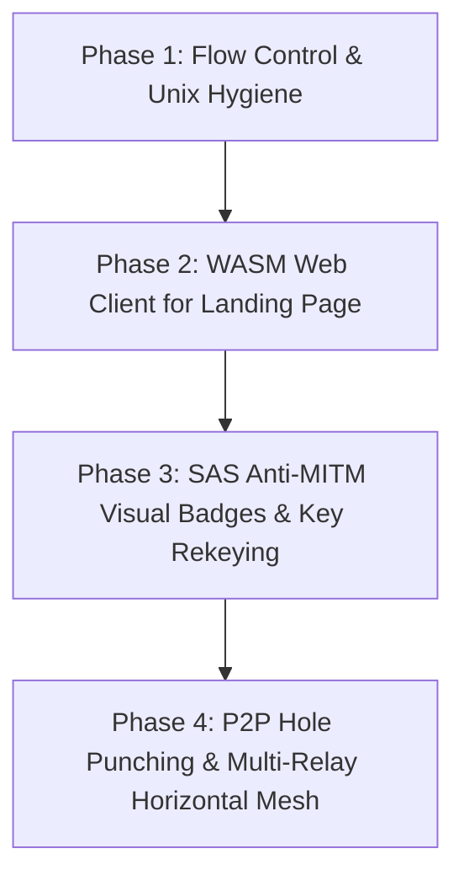

# ZeroFeed ⚡ Strategic Vision, Gaps & Architectural Roadmap

> **Document Status**: Active / Living Strategic Document  
> **Last Updated**: August 2026  
> **Primary Target**: Developer & SysAdmin Zero-Knowledge CLI (Caso A)  
> **Future Horizon**: Enterprise Cross-Cloud & CI/CD Streaming Engine (Caso B)

---

## 🎯 Executive Summary & Core Philosophy

ZeroFeed is built on the foundation of **Zero-Knowledge**, **RAM-only execution**, and **End-to-End Encryption (E2EE)**. 

### Core Product Evolution Strategy
1. **Phase 1 (Current - Caso A)**: The ultimate, lightweight, zero-dependency CLI tool for developers, DevOps, and SysAdmins to stream secrets, files, database dumps, and live logs between nodes safely (replacing legacy `scp`, `croc`, and unencrypted pipes).
2. **Phase 2 (Scalable Horizon - Caso B)**: Seamless transition to high-throughput enterprise infrastructure streaming, CI/CD pipeline secret injection, and multi-cloud database replication.

---

## 🛡️ Threat Model: "Pronti a tutto" (Zero-Trust Architecture)

Because ZeroFeed assumes **any network, intermediate node, or relay server can be compromised or untrusted**, the security posture adheres strictly to **Zero-Trust**:

| Component | Threat Assumptions & Defense Strategy |
| :--- | :--- |
| **Relay Node** | **Untrusted / Hostile**. The relay zero-persists data in RAM, cannot decrypt E2EE payloads (AES-256-GCM), and has no visibility into session keys (SPAKE2 PAKE). |
| **Transport Layer** | **Active Eavesdropping & Tampering**. All packets protected by TLS 1.3 / QUIC + application-level AES-256-GCM AEAD. |
| **Key Exchange (PAKE)** | **Active MITM Protection**. SPAKE2 prevents offline dictionary attacks. To withstand active MITM intercepters guessing channel codes, **Short Authentication String (SAS)** visual badges will be introduced. |
| **Memory Extraction** | **Host Inspection / Process Memory Dumps**. Addressed via `mlockall` (`crypto.LockMemory()`), `DisableCoreDumps()`, and explicit byte zeroing with `runtime.KeepAlive()`. |

---

## 💡 Architectural Gaps & Solution Roadmap

### 1. 🌊 Backpressure & End-to-End Flow Control (Low-RAM Optimization)
* **Problem**: A fast publisher (1 Gbps) sending data to a slow subscriber (10 Mbps) can accumulate buffered chunks on the Relay, threatening OOM kills on low-budget VMs (e.g. 512 MB RAM on Fly.io).
* **Solution**: Implement Relay-driven TCP backpressure and QUIC stream flow control. The relay halts reading from the Publisher socket when Subscriber buffers cross a configurable threshold (e.g. 16 MB).

### 2. ⚡ Direct P2P NAT Traversal (Hole Punching Fallback)
* **Problem**: Streaming large files through a central relay adds unnecessary latency and bandwidth cost when Publisher and Subscriber are on the same local network or reachable directly.
* **Solution**: Use the Relay as a *Signaling & PAKE Rendezvous Server*, then attempt STUN/UDP Hole Punching or local IP direct connection. Fall back seamlessly to Relay if P2P fails.

### 3. 🛡️ SAS (Short Authentication String) Visual Badge
* **Problem**: If an attacker intercepts the session code early, users need an out-of-band mechanism to verify they are connected to the intended peer.
* **Solution**: Display a 4-character visual fingerprint / emoji badge on both CLI terminals upon PAKE completion (`[SAS Verification Badge: 🛡️⚡9A4F]`).

### 4. 🌐 WebAssembly (WASM) & Browser Client (ZeroFeed-Landing Integration)
* **Problem**: Non-CLI users or web visitors cannot receive or decrypt shared files directly in their browser.
* **Solution**: Compile `pkg/crypto` and `pkg/protocol` to WebAssembly (`GOOS=js GOARCH=wasm`). Integrate into the sibling repository `ZeroFeed-Landing` so users can decrypt streams directly in browser memory without installing CLI binaries.

### 5. 🔑 Key Rekeying & Forward Secrecy per Chunk
* **Problem**: Continuous streams running for days or terabytes of payload reuse the same session key derived from the initial PAKE.
* **Solution**: Automatic in-stream key rotation (Rekey frame) every 1 GB of transferred data or every 1 hour of streaming.

### 6. 🌐 Multi-Relay Anycast & Horizontal Scaling ("Scalabile è Bello")
* **Problem**: Single relay host represents a single point of failure if regional outage occurs.
* **Solution**: Keep the Relay 100% stateless and RAM-only. Scale horizontally behind round-robin DNS or Anycast IP. Any relay node can route PAKE handshakes and streams via a lightweight internal mesh (Fly.io 6PN).

### 7. 🐚 Unix Pipe & `SIGPIPE` Handling
* **Problem**: Piping ZeroFeed into commands that terminate early (`zerofeed sub | head -n 10`) triggers `SIGPIPE` on `stdout`.
* **Solution**: Intercept `syscall.SIGPIPE` and handle write errors gracefully to exit with status 0 without printing tracebacks.

---

## 📈 Implementation Roadmap & Prioritization

1. **Immediate (Sprint 1)**: Backpressure Flow Control + `SIGPIPE` Graceful Termination + SAS Verification Concept.
2. **Short-Term (Sprint 2)**: WebAssembly (WASM) module for `ZeroFeed-Landing`.
3. **Mid-Term (Sprint 3)**: P2P UDP Hole Punching & Horizontal Relay Mesh design for enterprise scaling.

---

## 🌐 Public Network Sustainability & Economics ("Zero-Cost Infrastructure")

Can ZeroFeed sustain millions of public streams on free or low-cost relay nodes at steady state? **YES (for 90–95% of all traffic)** due to four core architectural pillars:

### 1. 🚀 Zero Storage (Zero Disk Persistence)
Unlike cloud storage providers (WeTransfer, Dropbox, S3), ZeroFeed **never writes payload data to disk or databases**.
- Zero NVMe/SSD storage costs.
- Zero database maintenance or indexing overhead.
- Relays run strictly in volatile memory: a 512 MB RAM instance effortlessly handles **> 5,000 concurrent active sessions**.

### 2. ⚡ P2P Direct Offloading (NAT Traversal & Hole Punching)
With P2P STUN/UDP Hole Punching:
- The public relay acts **only as a PAKE Signaling Rendezvous Server** (~2 KB per handshake).
- Once authentication is complete, payload streams bypass the relay and flow **directly peer-to-peer** between nodes.
- Public relay bandwidth consumption drops by **99%**.

### 3. 🕸️ Federated Community Relay Mesh
Because ZeroFeed Relay nodes are 100% stateless, ephemeral, and RAM-only:
- Anyone in the open-source community or partner network can launch a public relay node with a single command (`docker run -d zerofeed-relay`).
- Nodes federate behind round-robin Anycast DNS (`relay.zerofeed.app`).
- Regional node outages or VM expirations scale down gracefully without service interruption.

### 4. 💼 Freemium & Enterprise Sustainability Model
- **Public / Community Tier (0€)**: Unlimited P2P transfers + zero-config public relay fallback with soft rate-limiting (e.g. 50 MB/s per session) to prevent abuse.
- **Enterprise / Private Tier**: Companies deploy dedicated self-hosted ZeroFeed Relays within private VPCs / intranets for unthrottled gigabit streaming and complete data isolation.

